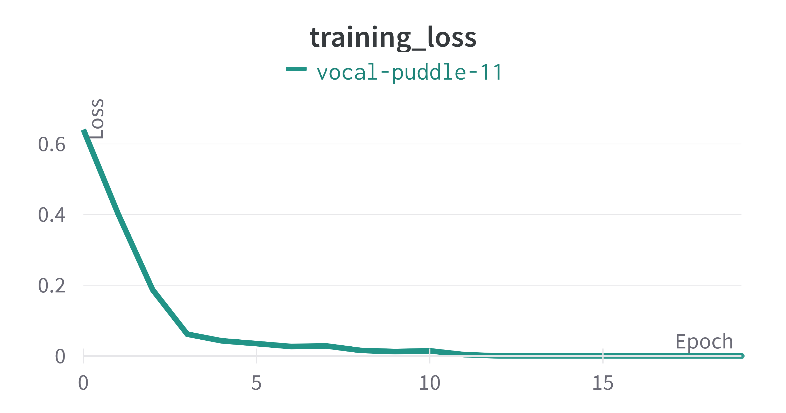

# 02476 Machine Learning Operations: Final Project

A project using the [Transformers framework](https://github.com/huggingface/transformers) (repository from the 🤗 Huggingface group).

## Group members
- Enny Tao (s174491)
- Anton Rydahl (s174515)
- Laurits Fromberg (s174512)
- Maria Fogh (s174498)

## Overall objective

This project will investigate how to use Machine Learning Operations tools in a project. We aim to exploit tools, including Cookiecutter for code structure to standardize the way of creating a project, Git to enable version control and collaboration, keep good coding practice (using e.g. Black or Flake8), and automate hyperparameter optimization. To illustrate the usage of these tools, we have chosen the task of using a classifier to determine whether movie reviews are positive or negative.

## Framework

In this project we intend to use the Transformers framework (repository from the 🤗 Huggingface group), which provides an array of pre-trained models,
for various uses such as text, vision and audio. We will in this project work with text data in
order to classify movie-ratings from IMDB, hence the reason for exploiting such framework.
We will more specifically employ the model BERT (Bidirectional Encoder Representations from Transformers) 
developed by Google, which is a Transformers-based machine-learning model for Natural Language Processing (NLP).

## Data

The data is found in the [Huggingface Datasets library](https://github.com/huggingface/datasets/) and consists of IMDB ratings. They have provided 25,000 highly polar movie reviews for training and 25,000 for testing. They also include an unlabelled version of the data. Specifically, the dataset contains a ‘text’ column, which is a string of the written review in itself and a ‘label’ column with possible values 0 and 1, describing whether it is a negative or positive review, respectively.

## Model

The BERT model was proposed in [BERT: Pre-training of Deep Bidirectional Transformers for Language Understanding](https://arxiv.org/abs/1810.04805) by Jacob Devlin, Ming-Wei Chang, Kenton Lee and Kristina Toutanova. 

We aim at fine-tuning the pre-trained BERT-model and thereby, hopefully include the logging tool Weights and Bias (wandb) in order to track the experiment and additionally, use the build-in feature for doing hyperparameter sweeping in wandb as well.

## Flowchart

<p align="center">
  
</p>

## Model Results

<p align="left">
  
</p>

<p align="right">
  
</p>


## Using Our API
We created an API using Google Cloud Functions. The API works by downloading our trained BERT model from Google Cloud Storage, passing the message through the tokenizer, and making a prediction from the tokenized message. 
An IMDB review can be passed on by the url parameter `message`.

```bash
curl https://europe-central2-mlops-transformers.cloudfunctions.net/bert-imdb2?message=""
```
If the <a href="https://europe-central2-mlops-transformers.cloudfunctions.net/bert-imdb2">cloud function</a> is opened in a browser, you will be provided with some nice memes as well to underline the validity of the predictions.

Project Organization
------------

    ├── LICENSE
    ├── Makefile           <- Makefile with commands like `make data` or `make train`
    ├── README.md          <- The top-level README for developers using this project.
    ├── data
    │   ├── external       <- Data from third party sources.
    │   ├── interim        <- Intermediate data that has been transformed.
    │   ├── processed      <- The final, canonical data sets for modeling.
    │   └── raw            <- The original, immutable data dump.
    │
    ├── docs               <- A default Sphinx project; see sphinx-doc.org for details
    │
    ├── models             <- Trained and serialized models, model predictions, or model summaries
    │
    ├── notebooks          <- Jupyter notebooks. Naming convention is a number (for ordering),
    │                         the creator's initials, and a short `-` delimited description, e.g.
    │                         `1.0-jqp-initial-data-exploration`.
    │
    ├── references         <- Data dictionaries, manuals, and all other explanatory materials.
    │
    ├── reports            <- Generated analysis as HTML, PDF, LaTeX, etc.
    │   └── figures        <- Generated graphics and figures to be used in reporting
    │
    ├── requirements.txt   <- The requirements file for reproducing the analysis environment, e.g.
    │                         generated with `pip freeze > requirements.txt`
    │
    ├── setup.py           <- makes project pip installable (pip install -e .) so src can be imported
    ├── src                <- Source code for use in this project.
    │   ├── __init__.py    <- Makes src a Python module
    │   │
    │   ├── data           <- Scripts to download or generate data
    │   │   └── make_dataset.py
    │   │
    │   ├── features       <- Scripts to turn raw data into features for modeling
    │   │   └── build_features.py
    │   │
    │   ├── models         <- Scripts to train models and then use trained models to make
    │   │   │                 predictions
    │   │   ├── predict_model.py
    │   │   └── train_model.py
    │   │
    │   └── visualization  <- Scripts to create exploratory and results oriented visualizations
    │       └── visualize.py
    │
    └── tox.ini            <- tox file with settings for running tox; see tox.readthedocs.io


--------

<p><small>Project based on the <a target="_blank" href="https://drivendata.github.io/cookiecutter-data-science/">cookiecutter data science project template</a>. #cookiecutterdatascience</small></p>
